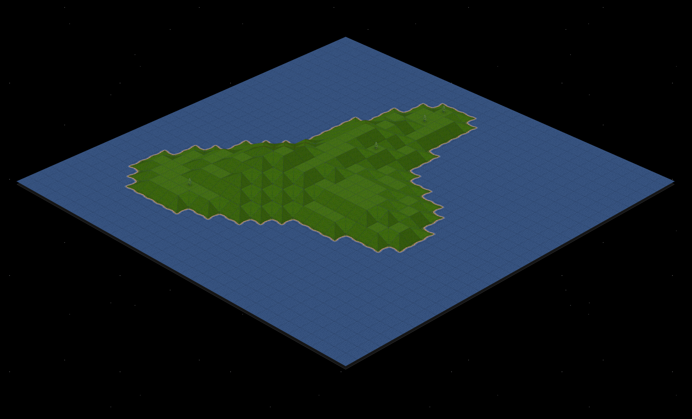

# Layoutit Terra

Layoutit Terra is a browser-based CSS terrain generator. The app builds
low-poly voxel terrain as real HTML/CSS 3D geometry, lets users edit terrain
height and shape directly in the browser, and exports the result as reusable
CSS/HTML, JSON, TXT, PNG, heightmap, or MagicaVoxel VOX data.

Use the live version: [terra.layoutit.com](https://terra.layoutit.com)



## How to Run

Install dependencies and run the local Nuxt dev server:

```sh
npm install
npm run dev
```

Build the production app:

```sh
npm run build
```

Generate the static site:

```sh
npm run generate
```

`npm run generate` writes static output to the ignored `dist/` folder.

## How It Works

Layoutit Terra is a Nuxt 2 static app. The editor state lives in the injected
Vue context from `plugins/globalObject.js`, and the main routes are:

- `/`: full terrain editor with toolbars, gallery panel, code panel, import, and
  export tools.
- `/embed`: compact auto-rotating terrain view for iframe embeds.

Terrain is stored as layered voxel data. `utils/generateTerrain.js` creates
seeded terrain from grid, biome, softness, and feature settings. The terrain
shape helpers in `utils/terrainMask.js` classify each level into flats, ramps,
wedges, spikes, cliffs, and shorelines. Vue components under `components/`
project those voxels into DOM elements styled with CSS transforms and texture
assets from `static/`.

The app does not use WebGL or a canvas renderer for the terrain scene. Canvas is
only used for auxiliary surfaces such as the minimap and PNG export.

## Exports and Embeds

The toolbar can export:

- `model.zip` with generated `index.html`, `styles.css`, `model.json`,
  `model.txt`, and `model.png`.
- Heightmap-oriented MagicaVoxel-compatible `.vox` model data.
- CodePen payloads.
- iframe embed code for the `/embed` route.

Terrain examples are encoded into the URL hash so a shared link can reproduce a
model without a backend.

## Gallery Saves

Gallery saving is optional. It uses Supabase only when both build-time
environment variables are provided:

```sh
NUXT_ENV_SUPABASE_URL=
NUXT_ENV_SUPABASE_ANON_KEY=
```

When those variables are missing, the Supabase plugin injects `null` and the app
can still run as a static editor.

## Repository Layout

- `components/`: Vue components for the editor UI, terrain pieces, icons, and
  texture components.
- `layouts/`: Nuxt page layout.
- `pages/`: Nuxt routes for `/` and `/embed`.
- `plugins/`: Nuxt plugins for global editor state, Prism, and optional
  Supabase access.
- `static/`: source static assets served by Nuxt.
- `utils/`: terrain generation, shape classification, camera, lighting,
  shoreline, and export helpers.

Generated Nuxt/build output, dependency folders, browser artifacts, and local
test output are intentionally ignored by Git.

## License

GPL-2.0-only. See [LICENSE](LICENSE).
